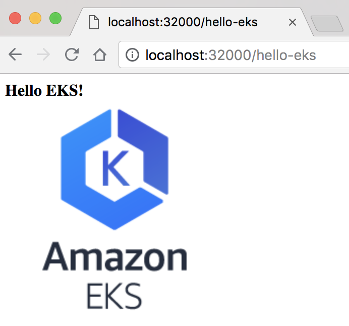

### Hello EKS!

To build and push https://hub.docker.com/r/gyuho/hello-eks:

```bash
$ ./build-push.sh
```

To test https://hub.docker.com/r/gyuho/hello-eks locally:

```bash
$ ./run-local-docker.sh
```

And open http://localhost:32000/hello-eks:


